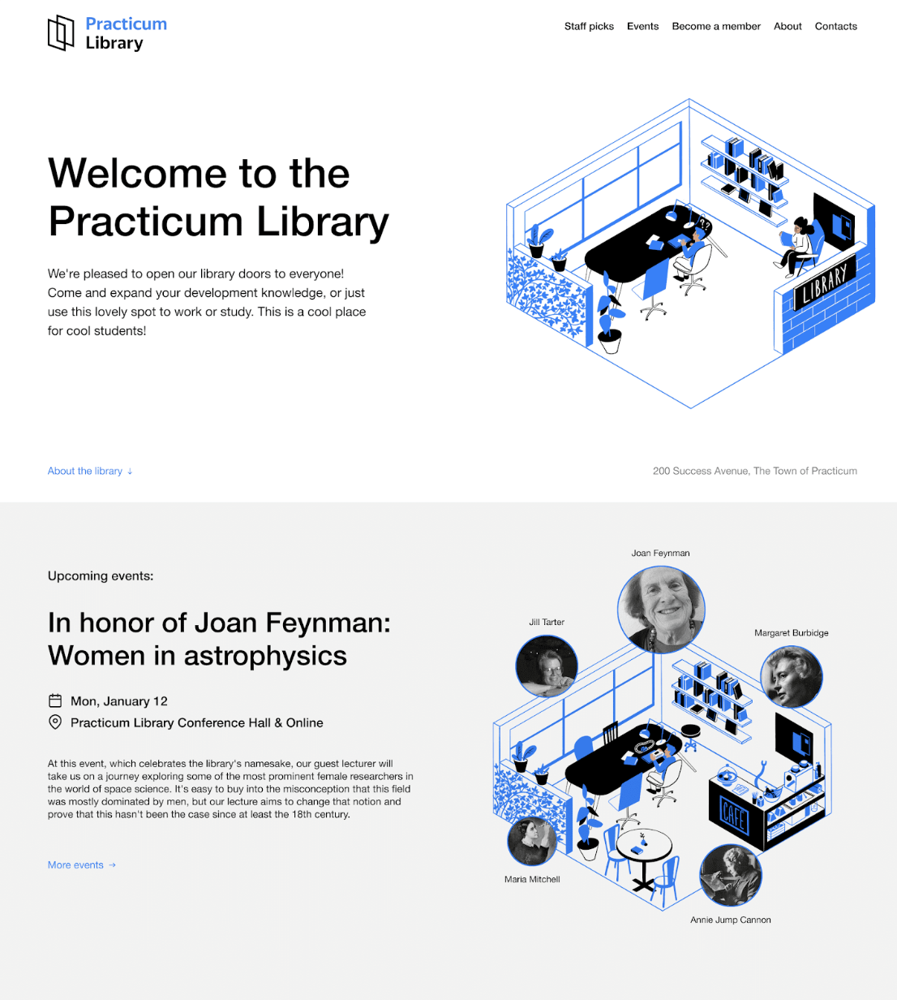
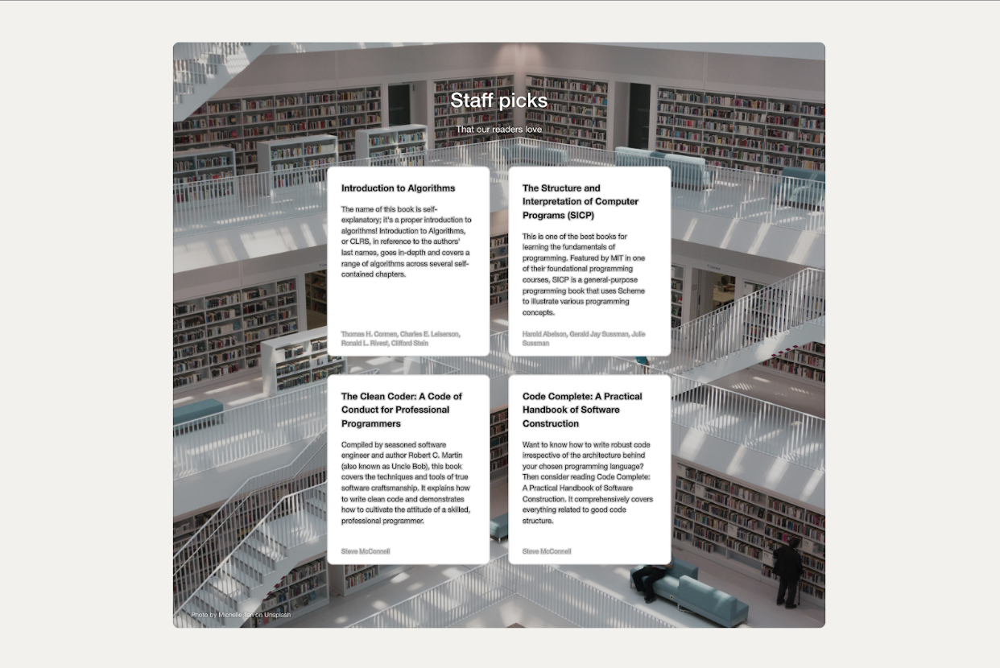
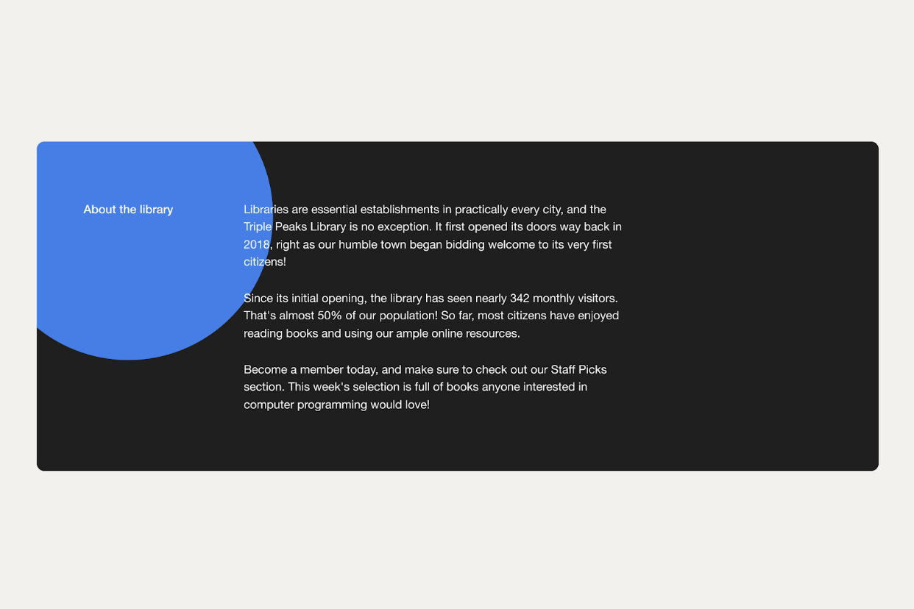
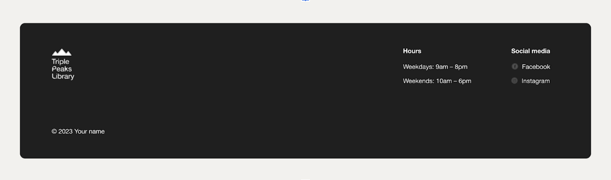

## Practicum Library

The Practicum Library is the first project in the Software Engineer program at Practicum. Its goal is to demonstrate fundamental front-end development skills using HTML and CSS. The project focuses on building a structured, visually organized webpage that follows a design brief, practicing semantic coding and layout techniques.

## Table of Contents

1. Overview
2. Features
3. Technologies Used
4. Implementation
5. Screenshots
6. Results
7. Future Improvements

## Overview

The objective of this project is to practice creating a static, responsive webpage using semantic HTML and CSS. The goal was to understand layout fundamentals and layering with z-index, while building a visually consistent page that aligns with the given design.

## Features

Semantic HTML5 structure
Flexbox for layout organization
Positioning and layering with z-index
Initial responsive structure for different screen sizes

## Technologies Used

HTML5 for semantic markup
CSS3 for styling and layout (Flexbox, positioning)
VS Code with Live Server for development

## Implementation

The project follows this workflow:

Analyzed the design brief and planned the layout.
Built the structure using semantic HTML5 tags.
Applied Flexbox and positioning techniques to arrange content.
Implemented z-index layering for visual depth.

## Project Structure:

practicum-library/
│── index.html
│── style.css
│── images/
│── README.md

## Screenshots:

Example:

## Results

Successfully built a working static webpage that loads quickly and displays correctly across modern browsers.
Improved understanding of semantic HTML and Flexbox layouts.
Project meets all initial design and functionality goals.

## Future Improvements

Add full responsive breakpoints for mobile and tablet devices.
Include hover effects and interactive elements using CSS transitions or JavaScript.
Optimize images for faster loading performance.
